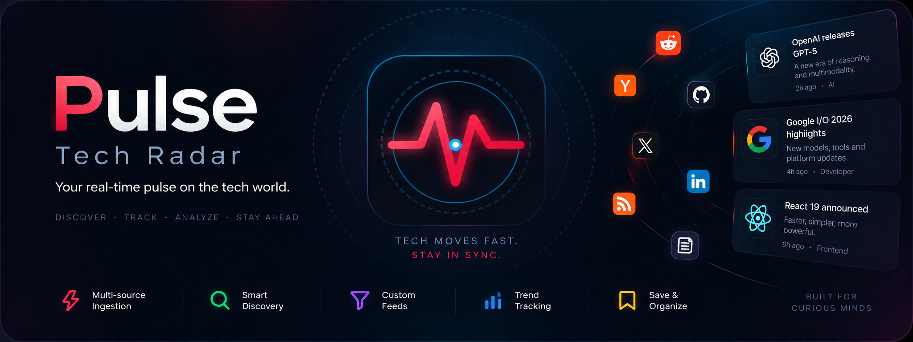
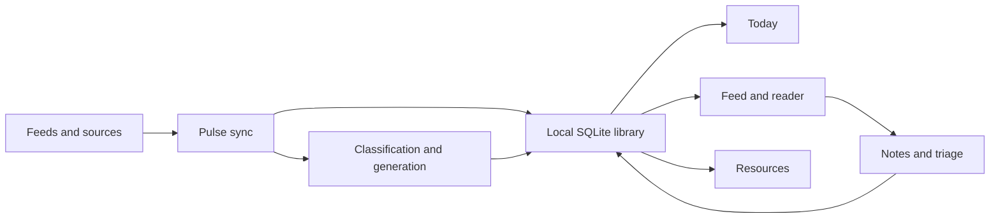

# Pulse

<p align="center">
  
</p>

<p align="center">
  <strong>A personal tech radar for discovering, filtering, and keeping up with what matters.</strong>
</p>

<p align="center">
  Pulse brings feeds, papers, repositories, tools, and technical discussions into one local desktop workspace.
</p>

## Why Pulse exists

The useful parts of the tech world are spread across too many places. A paper appears on arXiv,
the implementation lands on GitHub, someone explains it on Reddit, and the important context is
buried in a blog post or a discussion thread.

I wanted a calmer way to follow all of that.

Pulse collects the sources I care about, gives each item enough context to decide whether it is
worth my time, and keeps the resulting library on my machine. It is made for people who enjoy
following technology closely but do not want their entire day to become an unread queue.

## What Pulse does

| Area | What it gives me |
| --- | --- |
| Collection | Technical content from multiple sources in one place |
| Classification | Category, field, topic, and signal for each item |
| Daily view | A clear split between what was published and what was newly discovered |
| Triage | Save, mark important, archive, annotate, and open items quickly |
| Reader | Full-page fetching when an excerpt is not enough |
| Resources | Repositories, papers, products, and models extracted from what I read |
| Personal signal | Watchlists and reader feedback that influence ranking |
| Desktop workflow | Tray access and scheduled sync while Pulse is running |
| Data ownership | A local library and configuration without a Pulse account |

## The reading loop

Pulse is intentionally built around a short loop:

1. Connect the sources I actually follow.
2. Sync when I want a new batch.
3. Scan the feed and keep the promising items.
4. Open the reader when something deserves attention.
5. Save a note, fetch more context, or move on.

The interface is organized around that loop rather than around a large collection of settings.

## How it fits together



The frontend is a Next.js application loaded inside a Tauri desktop shell. Rust handles the
desktop integrations and background scheduler, while the local SQLite database remains the source
of truth for the library.

Items are stored with a content hash, so syncing the same source again does not create duplicate
entries or repeatedly spend classification calls on the same content.

## Sources

Pulse currently supports the following sources:

| Source | Collection style |
| --- | --- |
| Reddit | Chrome profile |
| X / Twitter | Chrome profile |
| LinkedIn | Chrome profile |
| Hacker News | Direct collection |
| GitHub Trending | Direct collection |
| arXiv | Direct collection |
| Hugging Face Papers | Direct collection |
| Lobste.rs | Direct collection |
| Dev.to | Direct collection |
| Product Hunt | Direct collection |
| RSS and Atom | Configurable feed URLs |

Public sources can be used immediately. Reddit, X, and LinkedIn use a local Chrome profile through
[`helmsman`](https://github.com/Kaushald4/helmsman-cli), because those sites are more reliable to
collect through a browser session than through a simple HTTP request.

Every source has its own options. Subreddits, keywords, arXiv categories, GitHub languages, RSS
URLs, and similar settings can be changed without affecting the rest of the library.

## The parts I use most

### Today

Today follows the local calendar day. It separates two questions that are easy to mix up:

| View | Question it answers |
| --- | --- |
| **Published today** | What was published today? |
| **New to Pulse** | What did Pulse discover today, regardless of when it was published? |

### Reader and triage

The reader keeps the original item, generated context, fetched content, and personal notes
together. From there I can save, mark important, archive, open the original page, or give Pulse
simple feedback about whether I want more items like it.

### Resources

Resources are the things mentioned by the items I collect: repositories, papers, products, models,
and useful sites. Pulse keeps those separate from the feed so a discussion can lead to a useful
resource without becoming the resource itself.

### Personal signal

Watchlists give matching topics a small ranking boost. **More like this** and **Less like this**
record feedback about an item's topic, source, and field. The original classifier score is kept
intact; personal ranking is applied on top of it.

### Tray and scheduled sync

The tray keeps Pulse close without keeping the main window open. It can open the app, start a sync,
or quit Pulse. Scheduled sync is tied to the running tray process, so it does not pretend to be a
closed-app background service.

## Privacy and data

Pulse does not require an account or a hosted library. The local library is stored in SQLite, and
the provider configuration is stored under `~/.pulse/config.json`.

When I configure an AI provider, the relevant content is sent to that provider for classification
or generation. Source requests also go to the source being collected. Apart from those explicit
requests, the library stays local.

## Setup

Pulse is currently developed and tested on macOS. Tauri configuration for other desktop platforms
is kept in the project as the app expands.

Requirements:

| Requirement | Why it is needed |
| --- | --- |
| Node.js 20 or newer | Runs the extraction engine |
| `pnpm` | Installs dependencies and runs project scripts |
| Chrome | Required for sources that use a browser profile |

Run the development app with:

```bash
pnpm install
pnpm tauri dev
```

Install the extraction engine from **Settings → Extraction engine → Install helmsman**. Pulse
places it under `~/.pulse/helmsman` and can update it from the same screen.

## Providers

Open **Settings → Providers** to configure the services Pulse can use:

| Provider | Used for |
| --- | --- |
| Cloudflare | Jev and Cloudflare models |
| OpenRouter | Chat and generation models |
| OpenAI-compatible endpoint | Custom model providers |
| GitHub token | A higher GitHub API rate limit; optional |

Classification and generation are separate settings. That means I can use Jev to sort items and a
different chat model to write the briefing, or use an LLM for both.

## Keyboard shortcuts

| Key | Action |
| --- | --- |
| `j` / `k` | Move through the feed |
| `Enter` / `Space` | Open the reader |
| `s` | Save the selected item |
| `i` | Mark it important |
| `a` | Archive it |
| `o` | Open the original URL |
| `⌘K` / `Ctrl+K` | Open the command palette |
| `Esc` | Close the reader or palette |

## Building

```bash
pnpm build
pnpm tauri build
```

The native output is written under:

```text
src-tauri/target/release/bundle/
```

The macOS WidgetKit source is kept under `native/macos/PulseWidget` for future work. It is not
embedded in the regular app or DMG at the moment.

## Project notes

| Layer | Choice |
| --- | --- |
| Frontend | Next.js with Tailwind CSS v4 |
| Desktop layer | Tauri v2 and Rust |
| Storage | Embedded local SQLite database |
| Sample data | Loaded only when I choose **Load sample items** |
| Development note | Do not run `pnpm build` while `pnpm dev` is running; both use `.next` |

Pulse is still evolving. The goal is not to collect everything. The goal is to make the signal
worth returning to.
